# 「よみやすさ」とは

## はじめに

ソフトウェア開発(プログラミング)をしていると、以下のような現象に見舞われることがある。

::labeled-container-with-fa-icon{type="bug" label="事例1"}

先輩から引き継いだソースコードが読みづらい。

::

::labeled-container-with-fa-icon{type="bug" label="事例2"}

過去に自分が書いたソースコードについて、何を書いているかわからなくなった。

::

::labeled-container-with-fa-icon{type="bug" label="事例3"}

共同開発者が記述するソースコードを読めない。

::

このような現象は、プログラミング初学者には現れにくいです。
しかし、様々な言語を学び始めて、いくつかの作品を作り始めた後にこう思うことがあります。
つまり、初級者から中級者にレベルアップしようとするときに多く発生します。

特に、複数人でプロジェクトを開始し始めるとこの問題に行きつくことがあります。
そしてこうなってから気づくのです。
**なぜ読みやすいソースコードを書いてくれないんだ！**

## 目的: 人にやさしく

### プログラミング言語の存在意義

なぜソースコードを読みやすくするのでしょうか？
それを知るためには、そもそもプログラミング言語がなぜ生まれたかについて知る必要があります。

コンピュータは計算機です。
計算の手順を記述したものがプログラムです。
皆様が `Windows` をお使いの場合、拡張子が `.exe`や `.dll` となっているものを見かけたことがあるはずです。
それが **プログラム** です。

ファイルの中身を見るとわかるのですが、人間にとってはただのデータの塊です。
少し勉強をするとわかるのですが、このデータは特定のルールに従って並んでおり、その意味を知れば読めるらしいのです。
コンピュータはこの形でしか理解できません(これを **機械語** と呼びます)。
少なくとも筆者にとってはとても読みづらし、書きづらいです。

コンピュータは機械語しか理解できず、人間の自然な言葉では動作しません。
この問題を解決するために、人間にわかりやすい命令方法（言葉）と、それを翻訳するプログラムが開発されました。
それが **プログラミング言語** と **コンパイラ** です。

[プログラミング言語 が人間にとって理解しづらいものになってしまうことは、その存在意義と大きく矛盾します。]{.red-text}
だからこそ、ソースコードはわかりやすく書くことが大切です。
コードを整えることで、読みやすくなり、誰が見ても理解しやすくなります。

### 他人に読みやすく

ソースコードを読みやすくすることの重要性を解説しましたが、それは誰にとってでしょうか？
誰のことか想像してみてください。

複数人で開発した経験がある人は、他のチームメンバが書いたソースコードを読みづらく感じた経験があるかもしれません。
個人で開発している人も、いくつかプロジェクトをこなしていくと、過去のプロジェクトで書いたソースコードを振り返ってみると、
「あれ？これ何だっけ？」となってしまうこともあります。

ここで大切なことは、**他人に** と書きましたが、**過去の自分も、もはや他人**になってしまうということです。
「個人開発なので、自分は大丈夫だ」と思っていても、不具合対応や機能拡張を行うとしたときに、過去に作りこんだ難読性が牙をむくのです。

## 大前提: 普遍性はない

そもそもソースコードの読みやすさってなんでしょう？
読みやすいというのは、もちろん主観的であり、感覚的なものです。
定量的に測れるものではありません。
したがって、普遍的な読みやすさというものがあるわけではないということを大前提にしてもらいたいです。

例えば、下記のようなコードがあったと仮定します。

```cpp
while ( flg1 )
{
    // ...
    if ( flg2 )
    {
        flg1 = false;
    }
}
```

このようなソースコードは `flg1` や `flg2` が何を指すための変数なのかわかりにくいので、読みやすくするために、「名は体を表す変数名」にすることが推奨されています。

```cpp
while ( !isBlocked )
{
    // ...
    if ( isCalled )
    {
        isBlocked = true;
    }
}
```

さらに、英単語 `Block` が否定的な意味を持っており、否定演算子 `!` と共存しているため、**二重否定** になっています。
*教科書どおり* にいうと、**読みにくいソースコード** と言われています。
したがって、以下のようなソースコードにすべきだといわれています。

```cpp
while ( mustBeContinue )
{
    // ...
    if ( isCalled )
    {
        mustBeContinue = false;
    }
}
```

読者の皆様はいかが感じたでしょうか？

大多数の読者は最後の例が一番読みやすいと感じたかもしれません。
参考文献に挙げたような教科書的にはそれが正解です。

しかしながら、残念ながら、場合によって最後の例が一番読みにくく感じる場合もあるのです。
現在のソフトウェア開発では複数人で開発することがほとんどです。
過去に誰かが開発したソフトウェアをメンテナンスすることもあります。



ソースコード全体を見渡したときに、今回の箇所だけが、「名は体を表す変数名」なっていた場合、その部分だけが「違和感」「異物感」が出てしまうのです。

このように読みやすさの根底には、「違和感」や「異物感」を生まない **統一性** を出すことがあります。

## What shall we do?

::labeled-container-with-fa-icon{type="success"}

技術的な努力と感性に訴えかける努力のたまものです。

::

前節で、読みやすさの根底には、「異物感」を生まない **統一性** が必要であることを述べました。
それでは、どういう努力をして **統一性** を持たせればいいのでしょう？
筆者は **技術的側面** と **感性的側面** の両面で努力が必要だと考えています。



### 技術的側面

技術的側面は、多くの参考文献や技術系ブログでも解説されているとおり、以下のようなものが挙げられる。

* 編集
  * 空白、コメント記述
  * 変数やメソッドの命名
* 設計
  * サイズや複雑さなどのメトリクス
  * モジュール構成や階層化等の構造

### 感性的側面

本書でこだわりたいのはもう1つの感性的側面です。

ソースコードは常に論理的に書くことが重要ですが、自然言語とは異なるため、人間にとっては必ずしも書きやすくはありません。
そのため、特に初学者は「とにかく動くコード」を優先しがちです。
動作すること自体は問題ありませんが、そうしたコードが積み重なると、後からの修正や保守が難しくなってしまいます。
ソフトウェアにまったく不具合がないことはほとんどなく、いざ直したい場面になっても「すでに動いていると変えたくない」という心理が働き、改善が後回しになりがちです。
その結果、長年にわたって複数人が関わるソースコードほど、それぞれの開発者が異なる思想や方針のもとで修正を加え続け、統一性のないまま維持されることになります。
そして最終的には、つぎはぎだらけのキメラのようなシステムが誕生してしまうのです。

ソフトウェアを長く快適に使い続けるためには、初めから「わかりやすさ」を意識した設計を心がけることが大切です。
モジュールごとの役割を決め、それらがどう関わり合うかを群像劇のようなストーリーとして捉えることで、全体像をつかみやすくなります。
そのストーリーが自然に伝わるよう、クラス構造やフォルダ配置を整理し、設計の背景や意図をメモとして残しておくと、あとで関わる人も理解しやすくなります。
そして保守の際は、初期の設計者が考えたストーリーや哲学を尊重しつつ、必要なアレンジを加えていくことで、コードの「読みやすさ」を引き継ぐことができます。
つまり、開発者はあとに続く保守者を意識してわかりやすいコードを残し、保守者はその思いを汲み取りながら改良を加えていく。
このような互いの思いやりこそが、ソフトウェアの「読みやすさ」を長く維持するための鍵なのです。

## 目標

::labeled-container-with-fa-icon{type="success"}

読みやすさを実現するための「がんばりポイント」について気づきを得る

::


このように本書では、読みやすいソースコードを記述するために、**感性的な** 側面と **技術的な** 側面の両面から考察します。

筆者は、プログラマ経験で多くの技術者と出会ってきました。
その中でも仲間内から、「XXさんの記述したコードは読みやすいよね」といわれていた技術者に共通することは何かを考えさせられてきました。
最初に、感性的側面から、筆者が思うソースコードを読みやすさを維持するためのマインドセットについて記述します。
その後、技術的側面から、筆者がかかわった多くのプロジェクトが運用いるコーディングルールをもとに、どのような要素で読みやすさを実現しようとしているのかについて解説します。

最後に、生成AIの登場により、年々優秀になっていく統合開発環境に実装されているソースコードリコメンデーション機能とソースコードの読みやすさの関係について考えます。
リコメンデーション機能との付き合い方について持論を展開したいと思います。
