# <i class="fa-solid fa-rocket"></i>「よみやすさ」とは

## はじめに

ソフトウェア開発(プログラミング)をしていると、以下のような現象に見舞われることがある。

::labeled-container-with-fa-icon{type="bug" label="事例"}

* 先輩から引き継いだソースコードが読みづらい。
* 過去に自分が書いたソースコードについて、何を書いているかわからなくなった。
* 共同開発者が記述するソースコードを読めない。

::

このような現象は、プログラミング初学者には現れにくいです。
初級者から中級者にレベルアップしようとするときに発生します。
様々な言語を学び始め、自身でいくつかの作品を作り始めた後、複数人で2～3プロジェクトをこなした後にこう思うことがあるのです。

そしてこうなってから気づくのです。

::chat

---
userName: 後悔する人
icon: fa-face-dizzy
iconColor: red

---

なぜ「よみやすいコード」を書かなかったんだ！

::

## 人にやさしく

### プログラミング言語の存在意義

なぜソースコードを読みやすくするのでしょうか？
それを知るためには、そもそもプログラミング言語がなぜ生まれたかについて知る必要があります。

コンピュータは計算機です。
コンピュータの計算手順を記述したものがプログラムです。
`Microsoft Windows` を使っていると、拡張子が `.exe`や `.dll` となっているものを見かけます。
それが **プログラム** です。

ファイルの中身は、人間にとってはただのデータの塊です。
少し勉強をすると、このデータは特定のルールに従って並んでいることがわかります。
もう少し勉強すると、その意味がわかり、読めるらしいのです
[(筆者は読むことができません)]{.text-weak}。
これを **機械語** と呼びます。

人間にはとても読みづらく、書きづらいです。
しかし、コンピュータはこの形でしか理解できません。
この問題を解決するために、
[人間にわかりやすい命令方法（言葉）]{.blue-text-emphasis}
と、
[それを翻訳するプログラム]{.blue-text-emphasis}
が開発されました。
それが
[プログラミング言語]{.red-text-emphasis}
と
[コンパイラ]{.red-text-emphasis}
です。

人間にわかりやすくよう設計された開発プログラミング言語を使って、
[理解しづらいコードを書くことは、矛盾します。]{.red-text-emphasis}
だからこそ、ソースコードはわかりやすく書くべきです。
プログラミング言語の設計思想に沿って、常によみやさを意識して、誰が見ても理解しやすいようにしましょう。

### 他人によみやすく

ソースコードをよみやすくすることの重要性を解説しましたが、それは[誰にとって]{.blue-text-emphasis}でしょうか？

複数人で開発した経験がある人は、チームメンバが書いたソースコードを読みづらく感じた経験があるかもしれません。
個人で開発している人も、過去に書いたソースコードを振り返ってみると、
「あれ？これ何だっけ？」となってしまうこともあります。

ここで大切なことは、**他人** には、**過去の自分も含まれる** ということです。
不具合対応や機能拡張を行うとしたときに、過去に作りこんだ「よみにくさ」が牙をむくのです。
「個人開発なので、自分は関係ないよ！」と思うことは、禁物です。

## 普遍性はない

そもそもソースコードの読みやすさってなんでしょう？
読みやすいというのは、もちろん主観的であり、感覚的なものです。
定量的に測れるものではありません。
したがって、[普遍的な読みやすさというものがあるわけではない]{.red-text-emphasis}ということを大前提にしてもらいたいです。

例えば、下記のようなコードがあったと仮定します。

```cpp
while ( flg1 )
{
    // ...
    if ( flg2 )
    {
        flg1 = false;
    }
}
```

このようなソースコードは `flg1` や `flg2` が何を指すための変数なのかわかりにくいので、読みやすくするために、
[「名は体を表す変数名」にすることを推奨します。](./technical/naming.md)

```cpp
while ( !isBlocked )
{
    // ...
    if ( isCalled )
    {
        isBlocked = true;
    }
}
```

さらに、英単語 `Block` が否定的な意味を持っており、否定演算子 `!` と共存しているため、**二重否定** になっています。
教科書どおりにいうと、
**読みにくいソースコード** と言われています。
したがって、以下のようなソースコードにすべきだといわれています。

```cpp
while ( mustBeContinue )
{
    // ...
    if ( isCalled )
    {
        mustBeContinue = false;
    }
}
```

読者の皆様はいかが感じたでしょうか？

おおくの読者は、最後の例が一番読みやすいと感じたかもしれません。
教科書的にはそれが正解です。
しかし残念ですが、最後の例が一番読みにくく感じる場面もあるのです。

一般的にソフトウェア開発では複数人で開発します。
過去に誰かが開発したソフトウェアをメンテナンスすることもあります。


ソースコード全体を見渡したときに、今回の箇所だけが、コードのトーンが異なっていた場合、その部分だけが「違和感」「異物感」が出てしまうのです。

このように読みやすさの根底には、「違和感」や「異物感」を生まない **統一性** を出すことがあります。

## What shall we do?

それでは、どのようにすればよみやすいコードが実現できるのでしょう？
筆者は **技術努力を惜しまず、感性に訴える** コードを実現し、それが**統一性を維持している**状態と考えています。



### 技術的側面

技術的側面は、多くの参考文献や技術系ブログでも解説されているとおり、以下のようなものが挙げられます。

* 編集
  * 空白、コメント記述
  * 変数やメソッドの命名
* 設計
  * サイズや複雑さなどのメトリクス
  * モジュール構成や階層化等の構造

まず、このような観点で、努力を惜しまないことが優先すべきことと考えます。
本書でも、そのポイントは後程紹介するつもりです。

### 感性的側面

本書で「こだわりたい」のはもうひとつのほうです。
感性的側面です。

人間は進化の過程で論理的思考は最後に獲得したといわれています。
すなわち、人間は論理的思考が生まれながらに不得意なのです。
その一方で、ソースコードは常に論理的に書くことが要求されます。
そのため、ソースコードは人間にとっては必ずしも書きやすくはありません。
特に初学者は少しでも論理的思考に終止符を打ちたくなるので、「とにかく動くコード」を優先します。

最初に計画したとおり動作はするので、その時点では全く問題ありません。
しかし、そうしたコードが積み重なると、後からじわりじわりと苦労が積み重なってきます。

*"No Code, No Bug"* とよくいいます。
すべてのコードにはバグがあるという前提で考えると、
将来、必ず改修や保守が発生します。
いざ直したい場面になっても「すでに動いていると変えたくない」という心理が働き、改善が後回しになりがちです。
その結果、長年にわたって複数人が関わるソースコードほど、それぞれの開発者が異なる思想や方針のもとで修正を加え続け、統一性のないまま維持されることになります。
そして最終的には、つぎはぎだらけのキメラのようなシステムが誕生してしまうのです。

ソフトウェアを長く快適に使い続けるためには、初めから「わかりやすさ」を意識した設計を心がけることが大切です。
モジュールごとの役割を決め、それらがどう関わり合うかを群像劇のようなストーリーとして捉えることで、全体像をつかみやすくなります。
そのストーリーが自然に伝わるよう、クラス構造やフォルダ配置を整理し、設計の背景や意図をメモとして残しておくと、後で関わる人も理解しやすくなります。
そして保守の際は、初期の設計者が考えた設計やその哲学やそのコードすべてを守るためなら少しくらいする苦労もいとわないという気持ちで関わりましょう。
つまり、開発者は後に続く開発者を意識してわかりやすいコードを残し、継ぐ者はその思いを汲み取りながら新らたなストーリーを紡いでいく。
このような互いの思いやりこそが、ソフトウェアの「よみやすさ」を長く維持するための鍵なのです。

## 目標

::labeled-container-with-fa-icon{type="success"}

読みやすさを実現するための「がんばりポイント」について気づきを得る

::

このように本書では、読みやすいソースコードを記述するために、**感性的な** 側面と **技術的な** 側面の両面から考察します。

筆者は、プログラマ経験で多くの技術者と出会ってきました。
その中でも仲間内から、「XXさんの記述したコードは読みやすいよね」といわれていた技術者に共通することは何かを考えさせられてきました。
最初に、感性的側面から、筆者が思うソースコードを読みやすさを維持するためのマインドセットについて記述します。
その後、技術的側面から、筆者がかかわった多くのプロジェクトが運用いるコーディングルールをもとに、どのような要素で読みやすさを実現しようとしているのかについて解説します。

最後に、生成AIの登場により、年々優秀になっていく統合開発環境に実装されているソースコードリコメンデーション機能とソースコードの読みやすさの関係について考えます。
リコメンデーション機能との付き合い方について持論を展開したいと思います。
